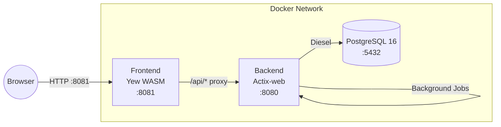

# Regional Tourism Resource & Lodging Operations Portal

A full-stack web application for managing tourism resources, lodging accommodations, inventory, and operational workflows across multiple facilities. The portal provides role-based access for Administrators, Publishers, Reviewers, Clinicians, and Inventory Clerks, supporting the full content lifecycle from draft creation through reviewer approval to publication, lodging management with deposit validation and rent-change workflows, facility-scoped inventory tracking with near-expiry alerts, bulk Excel import with progress tracking, watermarked export approvals, HMAC-signed connector integrations, and Prometheus-compatible observability — all deployed as three Docker services with a single command.

---

## Prerequisites

| Requirement | Version |
|---|---|
| **Docker** | 20.10+ |
| **Docker Compose** | 2.0+ (V2 plugin) |

No other tools, runtimes, or package managers are required. Everything builds and runs inside containers.

---

## Quick Start

```bash
docker compose up --build
```

Once all three services are healthy (typically 2-3 minutes for the first build):

| Endpoint | URL |
|---|---|
| Frontend (Yew SPA) | [http://localhost:8081](http://localhost:8081) |
| Backend API | [http://localhost:8080](http://localhost:8080) |
| Health Check | [http://localhost:8080/api/health](http://localhost:8080/api/health) |
| Prometheus Metrics | [http://localhost:8080/api/metrics](http://localhost:8080/api/metrics) |

Log in at the frontend with any of the default users listed below. The backend automatically seeds default users and a facility on first startup when the database is empty.

---

## Services

| Service | Image | Internal Port | Host Port | Purpose |
|---|---|---|---|---|
| `db` | `postgres:16-alpine` | 5432 | 5433 | PostgreSQL database with all schema migrations applied at startup |
| `backend` | Multi-stage Rust build (scratch) | 8080 | 8080 | Actix-web REST API with TLS certs, embedded migrations, background job runner |
| `frontend` | Trunk-served Yew WASM | 8081 | 8081 | Single-page application proxying `/api/*` requests to the backend |

---

## Default Users

The backend seeds these users automatically on first startup:

| Username | Password | Role | Facility | Access |
|---|---|---|---|---|
| `admin` | `admin123` | Administrator | All | Full access to every section |
| `publisher` | `publisher123` | Publisher | All | Resources, Lodgings (create/edit/submit) |
| `reviewer` | `reviewer123` | Reviewer | All | Resources, Lodgings (review/approve/reject) |
| `clinician` | `clinician123` | Clinician | Main Facility | Inventory (view, scoped to facility) |
| `clerk` | `clerk123` | InventoryClerk | Main Facility | Inventory, Import/Export (scoped to facility) |

---

## Testing

Run the full test suite (unit + API integration tests with coverage reporting):

```bash
./run_tests.sh
```

The script:
1. Builds and starts test containers using the `test` profile in `docker-compose.yml`
2. Waits for the PostgreSQL test database to become healthy
3. Runs **145 unit tests** covering all business logic and cryptographic functions
4. Runs **50 API integration tests** against a real database and running backend
5. Reports coverage for both suites independently

Expected output:

```
┌──────────────────┬────────────┬──────────┬────────┐
│ Suite            │ Coverage   │ Required │ Status │
├──────────────────┼────────────┼──────────┼────────┤
│ Unit Tests       │    9X.X%%  │    90%%  │ PASS   │
│ API Tests        │    9X.X%%  │    90%%  │ PASS   │
└──────────────────┴────────────┴──────────┴────────┘
```

Both suites must independently achieve >= 90% coverage. The script tears down all containers regardless of pass/fail.

---

## Architecture

### Backend (Actix-web / Diesel / PostgreSQL)

The backend follows a strict layered architecture where each layer depends only on layers below it:

```
api/          Actix route handlers and extractors (HTTP concerns only)
  |
service/      Pure business logic, validation, state machines
  |
repository/   Diesel-based PostgreSQL query modules
  |
model/        Domain structs, enums, DTOs
schema/       Diesel table definitions (21 tables)
```

Additional modules:
- `crypto/` — Argon2id, AES-256-GCM, TOTP, HMAC-SHA256, CSRF, SHA-256
- `middleware/` — Session-cookie extractor (`RbacContext`), `require_role!` macro
- `jobs/` — Background import job runner (tokio::spawn polling loop)
- `config/` — Strongly-typed TOML + env-var deserialization

### Frontend (Yew / WASM)

```
pages/        Route-level page components (login, dashboard, resources, etc.)
  |
components/   Reusable UI components (sidebar, toast, route guard, app shell)
  |
services/     API client (fetch-based with CSRF injection), masking utilities
  |
models/       TypeScript-style DTOs mirroring backend responses
context/      AuthProvider + ToastProvider (Yew context/reducer)
```

### System Diagram



---

## Security

### Authentication
- **Argon2id** password hashing with configurable memory/iterations/parallelism
- **Optional TOTP MFA** (30-second step, SHA-1, via totp-rs) with encrypted secret storage
- **HttpOnly / Secure / SameSite=Strict** session cookies (8-hour default expiry)
- **CSRF tokens** returned in response body, required as `X-CSRF-Token` header

### Authorization
- **Role-based access control** via `RbacContext` Actix extractor and `require_role!` macro
- **Menu visibility** — sidebar items rendered conditionally per role
- **Route guards** — frontend redirects unauthorized roles to /forbidden
- **Data-scope filtering** — Clinicians and InventoryClerks see only their facility's data

### Data Protection
- **AES-256-GCM column encryption** for sensitive fields (TOTP secrets, contact info)
- **Self-signed TLS certificates** generated at Docker build time
- **Upload validation** — extension allowlist + MIME sniffing via `infer` crate to reject mismatched types
- **Data masking** — phone numbers and emails rendered with partial redaction on the frontend
- **SHA-256 file checksums** computed and stored on every upload

### Compliance Features
- **Immutable transaction logs** — inventory transactions are insert-only with `is_immutable` flag
- **Second-person export approval** — exports require a different user to approve before download
- **Watermarked exports** — approved exports embed the approver's username and timestamp
- **Anti-replay connectors** — inbound payloads verified via HMAC-SHA256, with 5-minute timestamp window and nonce deduplication via `idempotency_keys`
- **Audit log** — every significant action recorded with actor, entity, detail, and IP

---

## API Overview

All endpoints are under `/api`. Authentication is required unless noted.

| Group | Method | Path | Roles | Description |
|---|---|---|---|---|
| **Health** | GET | `/api/health` | Public | Service health, DB connectivity, uptime |
| **Metrics** | GET | `/api/metrics` | Authenticated | Prometheus-format metrics |
| **Auth** | POST | `/api/auth/login` | Public | Login with username/password (+optional TOTP) |
| | POST | `/api/auth/logout` | Authenticated | Destroy session |
| | GET | `/api/auth/me` | Authenticated | Current user profile |
| **Resources** | POST | `/api/resources` | Admin, Publisher | Create resource (draft) |
| | GET | `/api/resources` | Admin, Publisher, Reviewer | Paginated list with filters |
| | GET | `/api/resources/:id` | Admin, Publisher, Reviewer | Resource detail |
| | PUT | `/api/resources/:id` | Admin, Publisher, Reviewer | Update resource / transition state |
| **Lodgings** | POST | `/api/lodgings` | Admin, Publisher | Create lodging |
| | GET | `/api/lodgings` | Admin, Publisher, Reviewer | List lodgings |
| | GET | `/api/lodgings/:id` | Admin, Publisher, Reviewer | Lodging detail |
| | PUT | `/api/lodgings/:id` | Admin, Publisher, Reviewer | Update lodging |
| | GET | `/api/lodgings/:id/periods` | Authenticated | List vacancy periods |
| | PUT | `/api/lodgings/:id/periods` | Admin, Publisher | Add vacancy period |
| | PUT | `/api/lodgings/:id/rent-change` | Admin, Publisher | Request rent change |
| | POST | `/api/lodgings/:id/rent-change/:cid/approve` | Admin, Reviewer | Approve rent change |
| | POST | `/api/lodgings/:id/rent-change/:cid/reject` | Admin, Reviewer | Reject rent change |
| **Inventory** | POST | `/api/inventory/lots` | Admin, Clerk | Create lot |
| | GET | `/api/inventory/lots` | Admin, Clerk, Clinician | List lots (with `?near_expiry=true`) |
| | GET | `/api/inventory/lots/:id` | Admin, Clerk, Clinician | Lot detail |
| | POST | `/api/inventory/lots/:id/reserve` | Admin, Clerk | Reserve stock |
| | POST | `/api/inventory/transactions` | Admin, Clerk | Record transaction |
| | GET | `/api/inventory/transactions` | Admin, Clerk, Clinician | List transactions (filterable) |
| | GET | `/api/inventory/transactions/audit-print` | Admin, Clerk | Printable HTML audit trail |
| **Media** | POST | `/api/media/upload` | Admin, Publisher | Multipart file upload |
| | GET | `/api/media/:id/download` | Authenticated | Download file |
| **Import** | POST | `/api/import/upload` | Admin, Clerk | Upload .xlsx for import |
| | GET | `/api/import/jobs/:id` | Authenticated | Job status and progress |
| **Export** | POST | `/api/export/request` | Authenticated | Request export |
| | POST | `/api/export/approve/:id` | Admin, Reviewer | Approve export |
| | GET | `/api/export/download/:id` | Authenticated | Download approved export |
| **Connector** | POST | `/api/connector/inbound` | HMAC-signed | Ingest external payloads |

---

## Configuration

All configuration is embedded directly in `docker-compose.yml` environment blocks and `backend/config.toml`. No `.env` files are used.

### Configuration Sources (in precedence order)
1. **Environment variables** — set in `docker-compose.yml` for each service
2. **config.toml** — checked-in TOML file copied into the backend container at build time

### Key Configuration Groups

| Group | Variables | Purpose |
|---|---|---|
| Database | `DATABASE_URL` | PostgreSQL connection string |
| Auth | `HMAC_SECRET`, `REQUEST_SIGNING_KEY` | Session signing, connector verification |
| Argon2 | `ARGON2_MEMORY_KIB`, `ARGON2_ITERATIONS`, `ARGON2_PARALLELISM` | Password hashing cost |
| Encryption | `AES256_MASTER_KEY` | Column-level AES-256-GCM encryption |
| TOTP | `TOTP_ISSUER` | MFA issuer name shown in authenticator apps |
| Uploads | `UPLOAD_MAX_SIZE_BYTES`, `UPLOAD_ALLOWED_MIMES` | File upload constraints |
| Features | `FEATURE_MFA_ENABLED`, `FEATURE_CSV_IMPORT`, etc. | Feature switches |
| Maintenance | `MAINTENANCE_WINDOW_CRON` | Cron expression for maintenance windows |
| Prometheus | `PROMETHEUS_SCRAPE_PATH` | Metrics endpoint path |
| Canary | `CANARY_PROFILE` | Release profile selector (`stable`/`canary`) |
| Profile | `CONFIG_PROFILE` | Environment name (`development`/`test`/`production`) |

### Environment-Specific Profiles

The `CONFIG_PROFILE` variable identifies the active environment. The backend reads `config.toml` for defaults and allows any value to be overridden via environment variables. Profile-specific parameters can also be stored in the `config_parameters` database table and managed through the Configuration Center UI (Administrator only).
